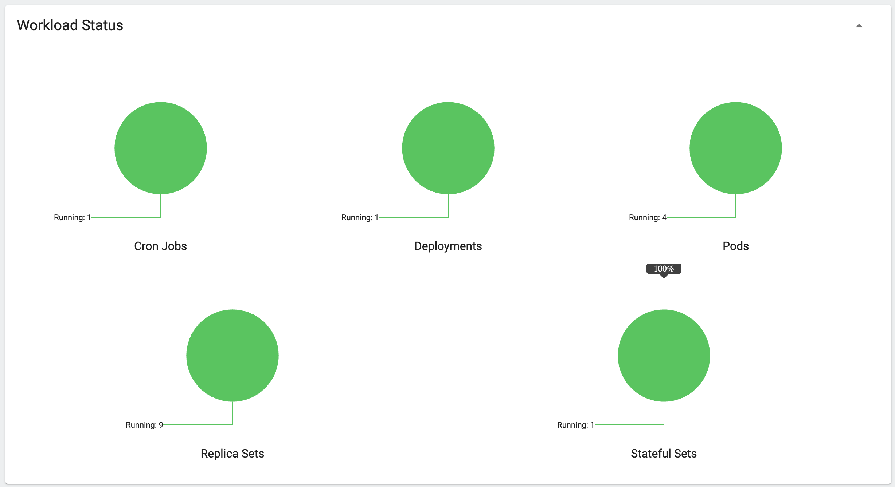
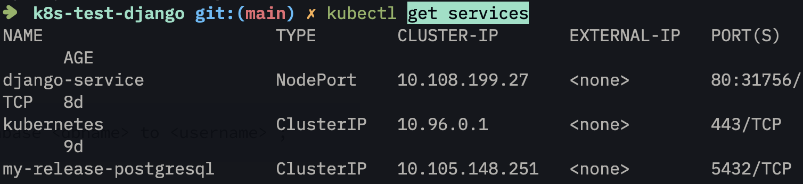

# Django site

Докеризированный сайт на Django для экспериментов с Kubernetes.

Внутри конейнера Django запускается с помощью Nginx Unit, не путать с Nginx. Сервер Nginx Unit выполняет сразу две функции: как веб-сервер он раздаёт файлы статики и медиа, а в роли сервера-приложений он запускает Python и Django. Таким образом Nginx Unit заменяет собой связку из двух сервисов Nginx и Gunicorn/uWSGI. [Подробнее про Nginx Unit](https://unit.nginx.org/).

## Как запустить dev-версию

Запустите базу данных и сайт:

```shell-session
$ docker-compose up
```

В новом терминале не выключая сайт запустите команды для настройки базы данных:

```shell-session
$ docker-compose run web ./manage.py migrate  # создаём/обновляем таблицы в БД
$ docker-compose run web ./manage.py createsuperuser
```

Для тонкой настройки Docker Compose используйте переменные окружения. Их названия отличаются от тех, что задаёт docker-образа, сделано это чтобы избежать конфликта имён. Внутри docker-compose.yaml настраиваются сразу несколько образов, у каждого свои переменные окружения, и поэтому их названия могут случайно пересечься. Чтобы не было конфликтов к названиям переменных окружения добавлены префиксы по названию сервиса. Список доступных переменных можно найти внутри файла [`docker-compose.yml`](./docker-compose.yml).

## Переменные окружения

Образ с Django считывает настройки из переменных окружения:

`SECRET_KEY` -- обязательная секретная настройка Django. Это соль для генерации хэшей. Значение может быть любым, важно лишь, чтобы оно никому не было известно. [Документация Django](https://docs.djangoproject.com/en/3.2/ref/settings/#secret-key).

`DEBUG` -- настройка Django для включения отладочного режима. Принимает значения `TRUE` или `FALSE`. [Документация Django](https://docs.djangoproject.com/en/3.2/ref/settings/#std:setting-DEBUG).

`ALLOWED_HOSTS` -- настройка Django со списком разрешённых адресов. Если запрос прилетит на другой адрес, то сайт ответит ошибкой 400. Можно перечислить несколько адресов через запятую, например `127.0.0.1,192.168.0.1,site.test`. [Документация Django](https://docs.djangoproject.com/en/3.2/ref/settings/#allowed-hosts).

`DATABASE_URL` -- адрес для подключения к базе данных PostgreSQL. Другие СУБД сайт не поддерживает. [Формат записи](https://github.com/jacobian/dj-database-url#url-schema).

## Как развернуть сайт с помощью minikube 

### Подготовка окружения

**Добавьте в рабочую директорию `.env.k8s` файл со следующими перемеными окружения:**

`SECRET_KEY` -- обязательная секретная настройка Django. Это соль для генерации хэшей. Значение может быть любым, важно лишь, чтобы оно никому не было известно. [Документация Django](https://docs.djangoproject.com/en/3.2/ref/settings/#secret-key).

`DATABASE_URL` -- адрес для подключения к базе данных PostgreSQL. Другие СУБД сайт не поддерживает. [Формат записи](https://github.com/jacobian/dj-database-url#url-schema).

`DATABASE_IP` -- публичный ip адрес базы данных, чтобы сервисы внутри кубера могли с ней общаться.

**Соберите docker-образы:**

```sh 
docker-compose -f docker-compose.k8s.yml build -q 
```

**Установите и запустите minikube:** 

Существует несколько вариантов запуска minikube, выберите оптимальный для себя. [Документация по установке.](https://minikube.sigs.k8s.io/docs/start/)  

```sh 
minikube start --driver docker
```

**Загрузите в minikube docker-образ:** 

```sh 
minikube image load django_app 
```

**Запустите контейнер с бд:**

```sh 
docker-compose --env-file .env.k8s -f docker-compose.k8s.yml up -d db 
```

**Перейдите в директорию с манифестами minikube:**

```sh 
cd minikube_deploy/
```

**Создайте config-файл с переменными окружения и подгрузите его в minikube:**

[Документация ConfigMap](https://kubernetes.io/docs/tasks/configure-pod-container/configure-pod-configmap/)

Пример конфига

```yaml 
apiVersion: v1
kind: ConfigMap
metadata:
  name: django-config
data:
  ALLOWED_HOSTS: 127.0.0.1, <site_domain> 
  DATABASE_URL: postgres://test_k8s:<database_password>@<database_ip>:5432 /test_k8s
  DEBUG: "FALSE"
  SECRET_KEY: <some_key> 
```

```sh 
kubectl apply -f config.yml
```

- Если вы измените данные в `config.yml`, то нужно сделать рестарт подов с контейнерами: 

```sh 
kubectl apply -f config.yml
```
 
```sh 
kubectl rollout restart deployment
```

- Посмотреть что находится в ConfigMap кластера можно так:

```sh 
kubectl get configmap -o yaml
```

### Запуск minikube манифестов

**Создаем деплоимент:** 

```sh 
kubectl apply -f django-deployment.yml
```

**Заполняем базу данных тестовыми данными:**

```sh 
kubectl apply -f django-migrate-job.yml
```

```sh 
kubectl exec -it <pod_name> -- ./manage.py createsuperuser
```
Имя пода можно посмотреть через `kubectl get pods`

**Применяем манифест Cronjob для удаления истекших сессий django:** 

```sh 
kubectl apply -f django-cronjon.yml
```

**Запускаем Ingress:**

```sh 
minikube addons enable ingress
```

- В манифесте `ingress-django.yml` добавьте домен сайта: 

```yaml 
spec:
  rules:
  - host: <you_domain>
```

```sh 
kubectl apply -f ingress-django.yml
```

```sh 
minikube tunnel
```

### Проверка работы кластера minikube

**Запустите dashboard:**

```sh 
minikube dashboard
```

- Если все успешно, то будет примерно такая картинка:




### ОПЦИОНАЛЬНО можно запустить postgresql в кластере

**Устанавливаем helm:**

[Документация](https://helm.sh/docs/intro/install/)
 
**Устанавливаем и настраиваем postgres в кластер:** 
 
 ```sh 
 helm install <db_service_name> oci://registry-1.docker.io/bitnamicharts/postgresql
 ```

- Подключаеся к поду с бд:

```sh 
kubectl run <db_pod_name> --rm --tty -i --restart='Never' --namespace default --image docker.io/bitnami/postgresql:16.1.0-debian-11-r4 --env="PGPASSWORD=$POSTGRES_PASSWORD" \
       --command -- psql --host <db_pod_name> -U postgres -d postgres -p 5432
 ```

 - Создаем бд:

```sql 
CREATE DATABASE test_k8s;
CREATE USER test_k8s WITH ENCRYPTED PASSWORD <passwor_for_db>;
GRANT ALL PRIVELEGES ON DATABASE test_k8s TO test_k8s;
ALTER DATABASE test_k8s OWNER TO test_k8s;
```

**Меняем в `config.yml` информацию для связи контейнера с сервисом бд внутри кластера:**

- Для связи в с контейнером снаружи кластера у нас использовался публичный IP хоста, теперь мы меняем его на CLUSTER_IP сервиса базы данных внутри кластера:


 
```yaml
data:
  DATABASE_URL: postgres://test_k8s:<db_password>@<CLUSTER_IP>:5432/test_k8s
```

```sh 
kubectl apply -f config.yml
```
 
```sh 
kubectl rollout restart deployment
```

**Заполняем базу данных тестовыми данными:**

```sh 
kubectl apply -f django-migrate-job.yml
```

```sh 
kubectl exec -it <django_pod_name> -- ./manage.py createsuperuser
```


 
